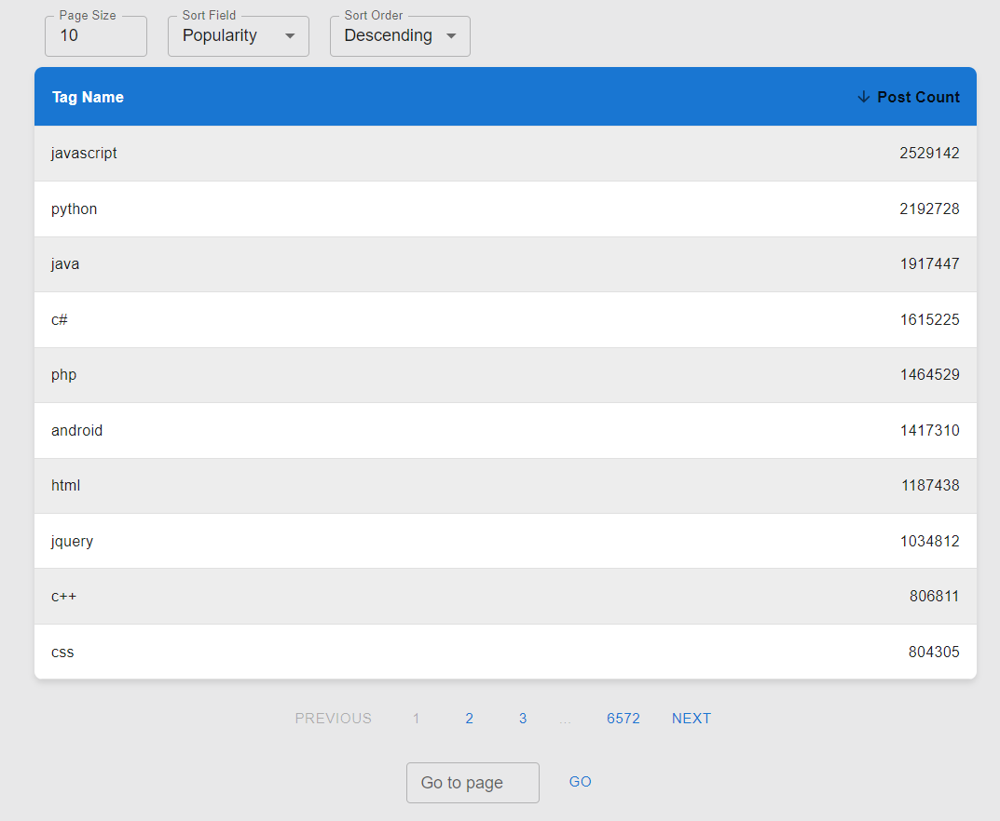

# TagList API App
Welcome to TagList, an application designed to provide a seamless experience for managing and organizing Stack tags. With TagList, you can effortlessly browse through it, customize your viewing experience with pagination and sorting options.

<div align="center">
  
</div>


## 💡 Technologies I Have Used


## 📚 Application Overview
TagList provides a comprehensive solution for managing API tags. Here are some key features:

- Sorting: Sort API tags based on criteria such as name or popularity.
- Pagination: Navigate through a large collection of API tags with ease using pagination controls.
- Customization: Tailor your viewing experience by adjusting page size, sort order, and other preferences.
- TagList offers a user-friendly interface and robust functionality to streamline your API management tasks.


## 💿 Installation Guide

To set up the TagList locally:

1. **Clone** repository to your local machine:
    ```bash
    git clone https://github.com/<YourGitHubUsername>/<RepositoryName>.git
    ```
2. **Navigate** to the project directory:
    ```bash
    cd <RepositoryName>
    ```
3. **Install** dependencies:
    ```bash
    npm ci
    ```
4. **Launch** the application:
    ```bash
    npm start
    ```
5. **Launch** the Storybook:
    ```bash
    npm run storybook
    ```

Now, you're ready to explore and modify the TagList.

## 🙋‍♂️ Connect With Me
I hope you enjoy using TagList! Feel free to connect with me for any questions or feedback.

[](https://www.linkedin.com/in/maciek-n%C4%99cka/)</br>

You can also visit my [portfolio website](https://maciejnecka.pl/) to learn more about my work.
